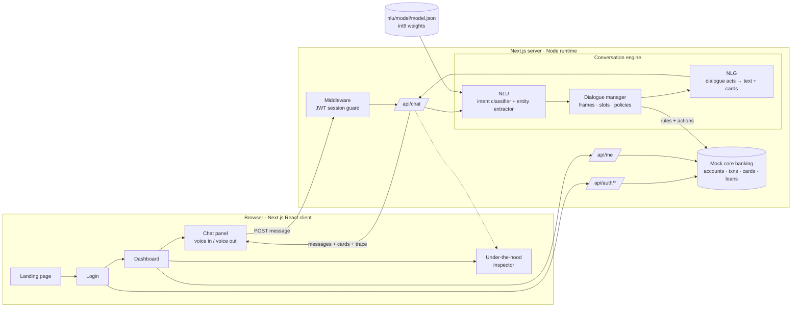
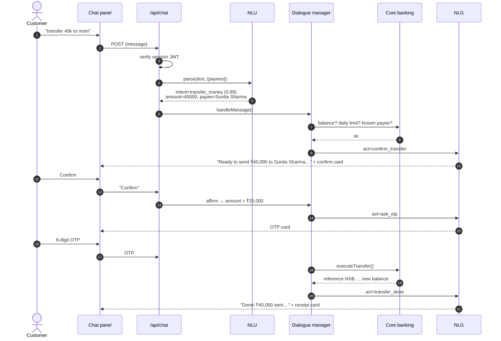
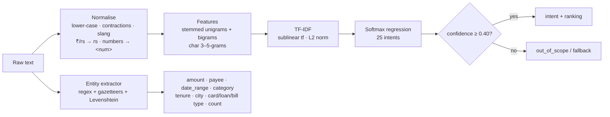
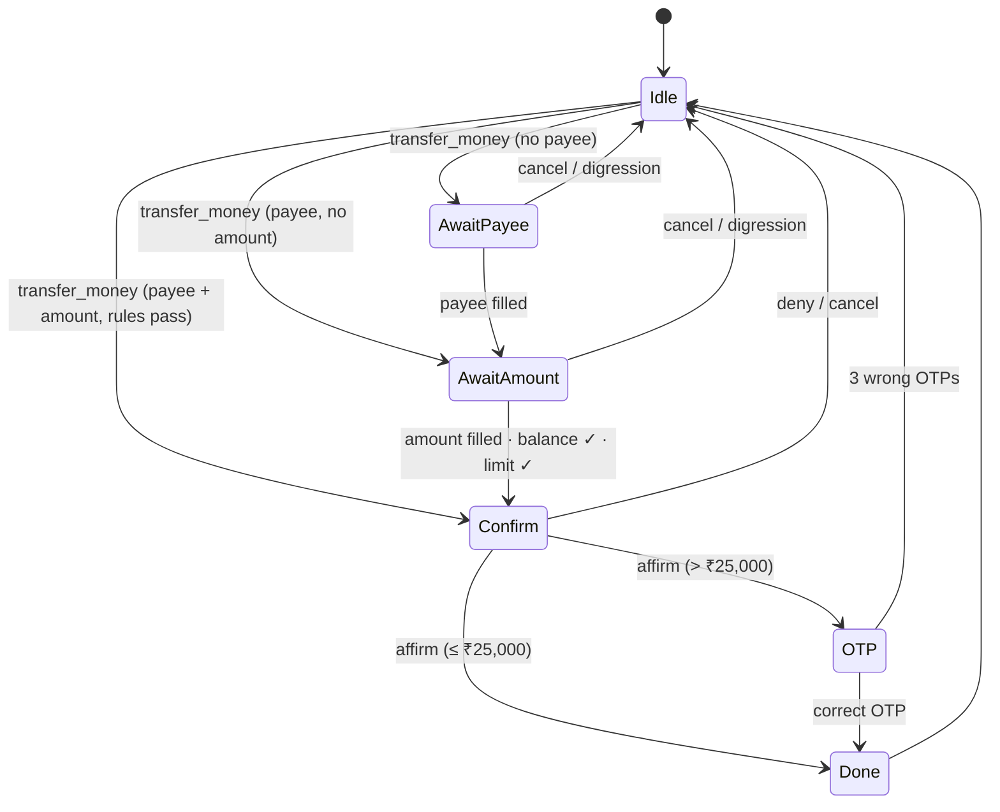

# NexaBank · Nova — Architecture

Nova is a conversational banking assistant for a fictional Indian retail bank. Every language component — **NLU**, **dialogue management** and **NLG** — is implemented in this repository with no external AI API, so each stage can be inspected, tested and explained.

---

## 1. System overview

| Layer | Location | Responsibility |
|---|---|---|
| Presentation | `src/app`, `src/components` | Landing (GSAP + Lenis motion system), login, dashboard, chat UI, rich cards, inspector (Framer Motion micro-states) |
| API | `src/app/api/*` | Auth (login/logout), chat turn, customer summary |
| Security | `src/middleware.ts`, `src/lib/auth.ts` | Signed JWT in httpOnly cookie, route protection, brute-force lock-out |
| NLU | `nlu/` | Normalisation → features → softmax classifier; rule + gazetteer entity extraction |
| Dialogue manager | `src/lib/bank/dialogue.ts` | Session state, slot filling, context carry-over, confirmation, OTP step-up, business rules |
| NLG | `src/lib/bank/nlg.ts` | Template bank per dialogue act, variation, Indian currency formatting, personalisation, hedging |
| Core banking (mock) | `src/lib/bank/data.ts` | In-memory ledger seeded deterministically; transfers, bill payments, card blocking |

---

## 2. One turn, end to end

---

## 3. NLU (Natural Language Understanding)

**Training data.** `nlu/data/intents.mjs` is a template grammar (364 templates, 11 slot lists). The generator expands templates with slot values, adds politeness wrappers and synthetic typos (character drop/swap/double), then de-duplicates → **2,874 utterances**.

**Model.** Multinomial logistic regression trained with per-feature AdaGrad and L2 regularisation for 40 epochs (~5 s on a laptop). Weights are **int8-quantised** and base64-packed (≈330 KB for 5,932 features × 25 classes).

**Evaluation.** `nlu/data/test.mjs` holds 88 hand-written phrases that are *not* generated from the grammar (typos, Indian-English, unseen wording). Current results: **94.3 % accuracy, 94.7 % macro-F1**. `npm run eval` prints every miss, e.g. “when is my emi due” → `card_info` instead of `loan_status`.

**Why character n-grams?** They make the classifier robust to misspellings (“trasnfer”, “balnce”) and to unseen inflections without a spell-checker.

**Entities.** Amounts understand `₹5,000`, `rs 750`, `15k`, `1.5 lakh`, `2 crore`; numbers followed by *years/months/transactions* are excluded. Payees are matched against the customer's saved beneficiaries including aliases (“mom” → Sunita Sharma) and with edit-distance 1 (“rohn” → Rohan Mehta). Dates resolve relative expressions (“last month”, “last 3 months”, “in August”).

---

## 4. Dialogue manager

Frame-based (slot-filling) policy with explicit states. Transfers, bill payments, card blocking and EMI calculation each open a **frame**; informational intents answer immediately.

Policies worth noting:

- **Slot filling across turns** — a bare answer (“3000”, “Neha”, “credit”, “15 years”) fills the awaited slot even when the classifier's intent is unrelated.
- **Context carry-over** — an elliptical follow-up that only contains entities (“what about this month?”) reuses the previous intent and merges entities.
- **Digression** — a confident new intent during a frame stops the frame and says nothing was sent.
- **Business rules** — known payee only, sufficient balance, ₹2,00,000 daily limit, OTP above ₹25,000, three OTP attempts.
- **Clarification** — a bare amount with no context gets “What would you like to do with ₹3,000?”.
- **Explainability** — every turn returns a `trace[]` that the dashboard's *Under the hood* panel renders.

Session state lives in server memory keyed by `userId:sessionId`, never in the browser, so OTPs and pending actions can't be tampered with.

---

## 5. NLG (Natural Language Generation)

`dialogue act + data → content selection → template choice → surface realisation`

- **Template bank** — 47 dialogue acts (`balance`, `confirm_transfer`, `ask_otp`, `emi`, `fraud`…), most with 2–3 phrasings chosen pseudo-randomly so Nova doesn't sound canned.
- **Surface realisation** — `en-IN` currency (₹3,65,528), spoken scale (₹28.7 lakh, ₹1.2 crore), list joining (“Rohan, Neha and Arjun”), pluralisation, relative dates (“in 6 days”), time-of-day greetings in IST.
- **Confidence hedging** — below 65 % confidence the reply is prefixed (“If I've understood you right — …”).
- **Multimodal output** — each message can carry a typed **rich card** (16 kinds: balance, statement, spending breakdown, transfer confirmation, OTP, receipt, EMI donut, eligibility, loans, rates table, branches, checklist, alerts, hand-off…). Optional text-to-speech reads replies aloud.

---

## 6. Security model

| Threat | Control |
|---|---|
| Session theft via XSS | JWT stored in `httpOnly`, `SameSite=Lax` cookie; `Secure` in production |
| Password guessing | `scrypt` hashes, constant-time compare, 5 failures → 10-minute lock-out |
| Unauthorised API use | Middleware verifies the JWT on `/dashboard`, `/api/chat`, `/api/me` |
| Acting on a misunderstanding | Every money movement needs explicit confirmation; NLU guesses never execute |
| Social engineering | Payments only to saved payees; OTP step-up above ₹25,000; fraud flow points to 1930 |
| Tampering with dialogue state | State and OTP held server-side only |
| Over-long input | Messages truncated to 500 characters |

> The demo shows the OTP on screen (“Demo SMS”) because there is no SMS gateway.

---

## 7. Production path

The demo keeps data in memory to stay self-contained. To take it further:

1. Replace `data.ts` with a real database (PostgreSQL) behind a repository interface.
2. Move sessions/dialogue state to Redis so the app scales horizontally.
3. Send OTPs through an SMS provider; add device binding.
4. Retrain the NLU on anonymised real chat logs; add active learning from low-confidence turns.
5. Swap the classifier for a transformer (e.g. fine-tuned DistilBERT / IndicBERT) behind the same `parse()` interface — the dialogue manager doesn't change.
6. Add Hindi/Tamil support via transliteration-aware features.
